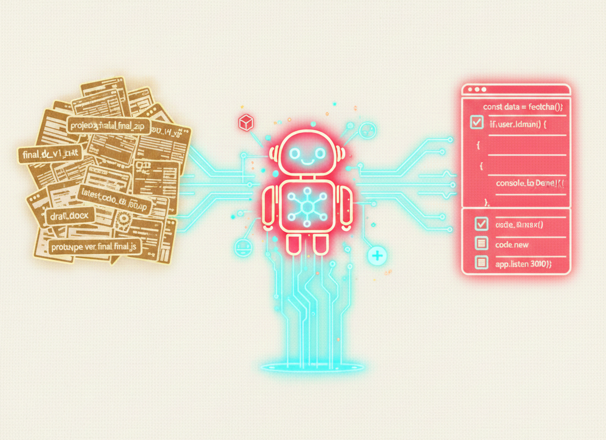

## はじめに

Claude は強力だ。質問を投げ、コードが返ってくる。修正案も、新機能も瞬時に提案される。一人で開発を進める場合、これほど心強いパートナーはない。

だが、プロジェクトが複雑になると、ある問題が生じ始める：

**「どれが最新のファイルだ？」**

---

## 第1章：調子に乗って開発する

本郷工業の HP リニューアルプロジェクトで、Claude に細かいバージョン変更を任せていた。

複数環境での開発が日常になっていた：
- Windows 11（会社）
- Mac mini M1（自宅）
- 複数フォルダ：`www-cojp`、`www-net`、`www-net2`

バージョン変更も頻繁だ：
- PHP 7.3 → PHP 8.3 対応
- 確認画面機能追加
- ファイル添付機能実装

Claude に指示を出す。「この部分を修正したい」と伝えれば、数分後にはコードが返ってくる。

快感だ。一人で、こんなに速く進むのか。

---

## 第2章：混乱が生まれる

### ファイル名の規則がない

実は、ここに落とし穴があった。

Claude には「ファイルをダウンロードさせて」対応していた。その際、**ファイル名に規則を作っていなかった**。

Claude なら細かいステップで変更しても文句を言わない。より細かいバージョンが出来上がる。

その結果、こんな名前のファイルが増えた：

```
❌ hongo_website_mobile_card_layout_v6.html
❌ hongo_website_mobile_card_layout_v7_fixed.html
❌ hongo_website_mobile_card_layout_v7_FIXED_BUG_v2.html
❌ hongo_website_fixed_v4.html
❌ hongo_website_mobile_fixed_v5_equipment_scroll.html
```

**バージョン番号、修正内容、大文字小文字が混在する。**

本来あるべき状態は：

```
✅ hongo_website_with_confirmation_v3.html（本体）
✅ qform_handler_with_attachment.php（本体）
└── ドキュメント類
```

だったはずだ。

### ミスと巻き戻しの混乱

さらに厄介なのは、**ミスもあり、巻き戻しもある**ということだ。

ある修正を Claude に依頼した。数分後、コードが返ってくる。実装する。

だが、問題が見つかる。「この部分が間違ってた」と気づく。では、どの版に戻すのか。

v6 か v7 か。FIXED か FIXED_BUG_v2 か。

ファイルシステムだけでは追跡できない。**「あのバージョン」を探すのに苦労した。**

---

## 第3章：GitHub を思い出す

ローカルファイルの混乱を前に、思い出した：

**「あ、GitHub があるじゃないか」**

実は、HP リニューアルプロジェクトは既に GitHub で管理されていた。リポジトリ `hongo-website-net` が存在した。

だが、当時の使い方は、**「変更履歴の記録」程度**だった。

Git コマンドで commit する。ログが残る。それだけ。

プロジェクト全体の進行管理はできていなかった。

「次は何をやるのか」「今どこまで来たのか」「なぜこの決断をしたのか」――これらは、チャットやメモに散在していた。

だが、**Git による「ファイルレベルの履歴管理」の価値には気づき始めていた。**

---

## 第4章：Git コマンドと付き合う

複数マシン（Windows/Mac）での開発では、Git が欠かせない。

v6, v7, v8 の混乱を経験した後、本気で Git コマンドの学習を始めた。

### 最重要：コミットメッセージ

Git の命令の中で、もっとも重要なのは **commit メッセージ**だと気づいた。

ファイルに何か変更を加えたら、commit する。その時に、**「何を」「なぜ」変更したのかを記録する。**

実際のプロジェクトでのコミットメッセージはこのようなものだ：

```
fix: iPhone での背景クリック対応
- touchend イベント専用ハンドラーを追加
- document.elementFromPoint() で正確な要素検出
- iOS Safari での背景タップで モーダルが閉じるように修正
```

また、複雑な修正はさらに詳しく記録される：

```
fix(scroll): デスクトップ版スクロール問題の完全修正 

- スマホヘッダー自動非表示機能を一時無効化
- メニュークリック時のオフセットを100pxに設定
- 確認画面表示時: confirmation-wrapperにスクロール（150px）
- 編集ボタン押下時: contactセクションにスクロール（100px）
- 沿革と代表者紹介の順序を修正
- 納入先実績を会社情報の前に移動
- 確認画面のテキスト切れを修正（word-break追加）

修正回数: 4回
テスト環境: Mac mini M1 (Chrome/Safari)
```

このメッセージがあれば、後から `git log` で「何がどう変わったのか」が分かる。具体的な技術詳細と、テスト環境まで記録されているから、同じ問題が再発しても原因追跡は速い。

### 巻き戻しが明確になる

v6, v7, v8 の混乱時代は、「どこに戻す」が不明確だった。

だが、Git ログを見れば：

```
commit 3a4b5c6 - fix: ファイル添付機能でのバリデーション修正
commit 2b3c4d5 - feat: ファイル添付機能を実装
commit 1a2b3c4 - fix: PHP 8.3 対応で引数の型チェック修正
```

**変更内容が明確だから、必要な commit に `git revert` で戻る判断も速い。**

### 複数マシン間の同期

Windows で開発し、Mac で確認する。その逆も然り。

Git があれば、`git push` で最新コードをサーバーに送る。別のマシンで `git pull` で取得する。

**ファイルシステムの混乱は起こらない。**

---

## 第5章：後から気づいたこと

このプロジェクトを進める中で、さらに上位レベルの管理が必要だと気づき始めた。

それが、**GitHub Issues によるプロジェクト管理**だ。

Git は「ファイルレベルの履歴管理」。
GitHub Issues は「タスク・プロジェクトレベルの管理」。

この二層構造で、初めて大きなプロジェクトが追跡可能になる。

ただし、HP リニューアル当時は、まだこのレベルの力量には達していなかった。

**それは後編で詳しく述べる。**

---

## おわりに：Claude と Git、両方あってこそ

このプロジェクトを通じて気付いたことは、単純だが強力だ：

**Claude と Git は、相互補完的なツールである。**

### Claude の役割
- 実装の詳細を提案
- コード品質を向上
- 試行錯誤を加速
- 細かいバージョン変更を厭わない

### Git の役割
- ファイルレベルの履歴管理
- 変更内容を記録（commit メッセージ）
- 複数マシン間での同期
- 巻き戻しを明確にする

Claude だけでは、ファイルは混乱（v6, v7, v8）し、なぜそう決めたのかは忘れられる。

Git だけでは、実装は遅く、詳細なコード提案は期待できない。

だが、**両者を組み合わせると？**

- Claude で素早く実装する
- Git でその履歴を明確に記録する
- commit メッセージで「何を」「なぜ」を残す
- 複数マシン環境でも、追跡可能なプロジェクト管理ができる

そして何より重要なのは、**「なぜこうなったのか」を、いつでも追跡できる**ということだ。

これは、AI と人間の協働において、もっとも大切な特性かもしれない。

---

## 次号予告（後編）

後編では、さらに上位レベルのプロジェクト管理を紹介する。

- GitHub Issues によるタスク管理
- Issue と commit の連携
- @claude タグでの Claude との協働

乞うご期待。
