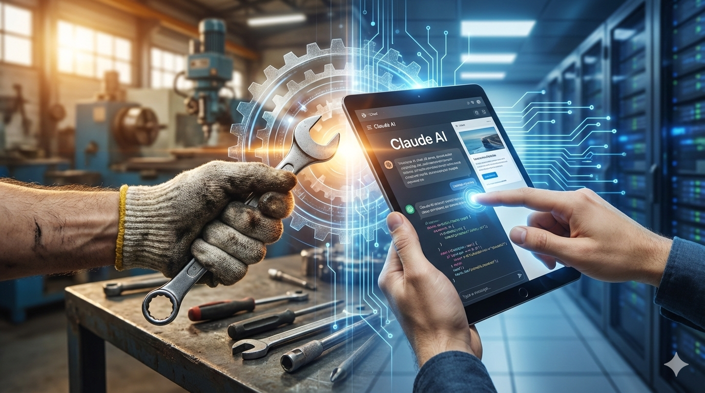

## はじめに：「自分でやる」という選択の正体

HPのリニューアルを決めるとき、私たちの前には大きな選択肢がありました。外注するか、自社でやるか。

経営者の観点では、この選択は単純に見えます。外注 vs 自社化、コストと時間のトレードオフ。しかし現実は、もっと曖昧でした。

私個人の気質として、パソコンに関わることは「自分で触らないと気が済まない」という癖がありました。そのため、外注を真剣に検討する相談相手がいなかったのです。費用はどのくらいかかるのか、品質をどこで判断するのか、そもそも信頼できる相手をどう選ぶのか——こうした問いに答えられる人が身近にいなかったのです。

「ダメで元々、うまくいくならラッキー」

そんな気軽さで、自社実装を選びました。ただし、この決断の背後には、深い試行錯誤の歴史がありました。

---

## 第1章：外注を判断できない理由

中小製造業の経営層にとって、WebサイトのリニューアルはIT投資の一大事です。しかし多くの場合、判断基準が曖昧なままです。

**費用の不確実性**

外注での見積もりを取ったことがないため、修正費用がどのくらいかかるのか想像すら難しい。1回の修正が1万円なのか、10万円なのか、相場そのものが不明です。

やり取りの時間も予測不可能です。メールでの質疑応答、打ち合わせ、修正待ち——これらが積み重なると、予定していた納期を大幅に超えることもあります。

**品質をどこで判断するのか**

納期に間に合ったから満足、という単純な話ではありません。SEOは適切に設定されているのか、モバイル表示は大丈夫か、セキュリティ対策は万全か。こうした要素を自分たちで検証できなければ、品質の良し悪しを判断できません。

**相談相手がいない**

ここが最大の課題でした。自分たちが何を求めるのか、どの業者に依頼すべきなのか、トラブルが起きたときはどうするのか——こうした問いに答えてくれる人がいないのです。

Web制作の知識を持つ人材が経営層にいれば別ですが、多くの中小企業では「Webサイトはあるが、どうやって管理するのかは謎」という状態で運営しています。

この不確実性が、自社実装という選択肢を、相対的に「まし」な判断に見せていたのです。

---

## 第2章：ツール選びの試行錯誤

自社実装を選んだからといって、すぐに成功したわけではありません。むしろ、道具選びの失敗の連続でした。

**ホームページビルダーの時代**

インターネット初期には、ホームページビルダーを使って自社サイトを作成していました。ドラッグ&ドロップで画面を編集する、当時としては革新的なツールです。

しかし課題がありました。ツールを「使う」のは簡単ですが、その背後にあるHTML やCSSの知識がなければ、カスタマイズの幅が限定されます。そして何年も経つと、その知識を維持すること自体が負担になります。ツールのアップデートに対応し、Webの標準化についていく——これは個人や小さなチームには大きな負荷でした。

**QHMへの移行**

次に選んだのがQHM（Quick Homepage Maker）という**CMS的なシステム**（Webサイトのコンテンツを直感的に管理・編集できるツール）でした。HTMLやCSSの学習負荷を減らし、コンテンツ作成に重点を置こうという戦略です。

しかし QHMも時代とともに更新が停止し、次のベースに移行しなければならなくなります。

**CMS検討の挫折**

では、WordPress などのCMSに移行しようか——そう考えて検討を始めました。しかし学習敷居の高さに直面しました。

今思えば、これは「必要なコストを払っていなかった」からです。CMS を導入し、きちんと運用するには、それなりの知識投資が必要です。しかし私たちはそれを正当な投資として見なさず、「無料で済ませたい」という甘い期待を持っていたのです。

この一連の失敗は、外注か自社化かという二項対立ではなく、「自社化するなら、何にいくらの投資をするのか」を決めることの重要性を教えてくれました。

---

## 第3章：「ダメで元々」で自社実装へ

外注か自社化か——その判断のとき、私たちにあったのは「ダメで元々、うまくいくならラッキー」という気軽さでした。決して前向きな選択ではありません。むしろ、消極的な決断です。

**ツール選びの疲労感**

ホームページビルダー、QHM、CMS検討……この試行錯誤の過程で、私たちは学習疲労を抱えていました。新しいツールを導入するたびに、その背後にある原理を理解し、カスタマイズし、メンテナンスする。このサイクルが何度も繰り返されると、「もう何かを習わなければならないのは嫌だ」という気分になります。

そんなタイミングで、生成AIが登場しました。「これなら、わからないことを聞きながら進められるかもしれない」——そんな期待が、自社実装を現実的な選択肢に見せたのです。

**隠れた敷居の存在**

しかし、自社実装は見た目ほど簡単ではありませんでした。

HTMLやCSSを書く以前に、越えなければならない敷居がたくさんありました。

- **サーバー・FTPの知識**：Webサイトをインターネットに公開するには、サーバーの基本を理解し、FTPツールの設定ができなければなりません。実は、製造業の現場では、工作機械のプログラム転送や、社内書類のバックアップのためにFFFTPやサーバー・NASを使用しています。私たちも、その経験があったからこそ、「FTPなら何とかなるかもしれない」と思えました。しかし、Webサイト公開のためのサーバー設定は、工業用システムのそれとは異なります。それでも、「全くの未経験」よりは、一歩前に出ることができた背景がありました。

- **「普通でない」セッティング作業**：レンタルサーバーの種類によって、設定方法は異なります。セキュリティ設定、データベース接続、ドメイン設定——これらの多くが、直感的ではありません。ただし、私たちの会社では、DOS、Windows 95から Windows 11まで、ほぼすべてのOSを扱ってきました。全く同じ環境のパソコンは10台以上の中にも存在しません。その経験から、「新しい環境に対応する」という苦労は、むしろ日常のものでした。パソコンのセッティングや、予期しないエラーへの対応は、さほど珍しいことではなかったのです。

- **トラブルは全て自分の手に**：何か問題が起きたとき、外注なら「業者に連絡する」という選択肢がありました。自社実装なら、その問題はあなたの責任です。エラーメッセージの意味を調べ、原因を特定し、対策を立てる——すべてが自分たちの肩にかかります。しかし、多種多様なパソコン環境を管理する製造業の現場では、トラブルの自己解決は必然です。外部に相談できる相手も限られています。だからこそ、この「全て自分で解決する」という負担は、新しいものではなく、むしろ「慣れたもの」でした。

零細企業の中の人は大変です。しかし、その「大変さ」が、新しい挑戦に対する耐性を育んでいたのです。

---

## 第4章：生成AIが何を変えたか

ここまでの試行錯誤を経た私たちが、最後に頼ったのが生成AIです。この章では、生成AIが自社実装の「敷居」をどこまで下げたのか、そして限界は何かを、具体的な実例で示します。

**FTP設定のプロンプト例**

Webサイトをレンタルサーバーに公開するには、FTPツールの設定が必要です。これは「普通のビジネスパーソン」にとって、大きな壁です。

ここで生成AIの出番です。

例えば、こんなプロンプトを送ります：
```
私は FFFTP というFTPツールを使っています。
レンタルサーバーは Lolipop です。
以下の情報が手元にあります：
- ホスト名：[ホスト名]
- ユーザー名：[ユーザー名]
- パスワード：[パスワード]

FFFTP の設定画面をスクリーンショットで送ります。
どこに、何を入力すればいいですか？

[スクリーンショット]
```

生成AIは、スクリーンショットを見ながら、具体的な設定手順を教えてくれます。単なる一般的な説明ではなく、「あなたの画面に対する」具体的な指示です。

このような使い方が可能になったことで、「FTPって何？」という状態から、わずか15分で接続を完了できるようになりました。

**トラブルシューティングの実例**

自社実装を進める過程で、予期しないエラーに遭遇することは避けられません。

例えば、ホームページをサーバーにアップロードしたのに、ブラウザで表示されない。そんなとき、以前なら「何が悪いのか」を手探りで調査していました。

生成AIの時代は異なります。
```
このようなエラーが表示されます：
[エラーメッセージ全文]

このエラーの意味は何ですか？
何が原因だと考えられますか？
どうすれば解決できますか？
```

このように、エラーメッセージをそのままコピー&ペーストして質問するだけで、原因特定と対策が返ってきます。しかも、複数の可能性を示してくれるため、試行錯誤の時間が大幅に短縮されます。

**生成AIの限界**

しかし、生成AIが万能なわけではありません。特に、特定のサーバーやツールに固有の設定に関しては、限界があります。

例えば、Lolipop というレンタルサーバーには、独自の設定画面や制限があります。生成AIは「一般的なレンタルサーバーの設定」は教えてくれますが、「Lolipop特有の仕様」については、公式ドキュメントを参照する必要があります。

同様に、PHPのバージョン更新、セキュリティ設定の細部、データベースのパラメータなど——こうした「サーバー環境に深く依存する」設定については、生成AIの回答が不正確になる可能性があります。

実装の現場では、生成AIの回答と公式ドキュメント、両方を参照しながら進めることが重要です。「生成AIが言ったから大丈夫」という過信は危険です。

**AIの素人から玄人へ**

自社実装を進める過程で、私たちは「生成AIの使い手」になりました。

最初は、単純な質問をしていました。「FTP設定について教えてください」「このエラーは何ですか？」

しかし、実装を重ねるにつれ、より精密な質問ができるようになりました。「このスクリーンショットの、この部分について教えてください」「この条件のとき、次のステップは何ですか？」

生成AIは、あなたの質問の精度に応じて、回答の質も変わります。漠然とした質問には、漠然とした答えが返ってきます。具体的で、文脈に富んだ質問には、具体的で有用な答えが返ってきます。

この学習プロセスそのものが、自社実装を現実的なものにしたのです。

---

## おわりに：「やればできる」の根拠が生成AIで作られた

HPリニューアルの自社実装を決めたとき、私たちは「ダメで元々」という気軽さで踏み出しました。

それは、自信からではなく、外注の不確実性に対する諦観から生まれた決断でした。

しかし、実装を進める過程で、状況は変わりました。

生成AIという道具が、単なる技術的な敷居を下げただけではなく、「自分たちでやることができる」という現実的な根拠を与えてくれたのです。

**「やればできる」は、根拠のない楽観主義ではない**

ただし、誤解してはいけません。生成AIがあれば、すべてが解決するわけではありません。

サーバーの独自仕様には対応できません。セキュリティの細部について、生成AIの回答が不正確である可能性があります。新しい問題に直面したとき、自分たちで調査し、判断し、決断しなければならない場面は何度も訪れます。

つまり、自社実装は「楽になる」のではなく、「可能になる」のです。

**中小製造業の経営層へのメッセージ**

外注か自社化か——その判断をするときは、以下の観点を参考にしてください。

- **不確実性の種類は何か**：外注の不確実性（コスト、品質、納期）と、自社化の不確実性（技術習得、トラブル対応）のどちらが、あなたの経営リスクを高めるのか。

- **環境資産を活かせるか**：多くの中小製造業は、予期しない環境変化に対応してきた履歴があります。様々なOSやツールを扱い、トラブルを自己解決してきた経験は、新しい技術習得の際に大きな強みになります。

- **現在の技術的サポート体制は何か**：外注するなら、その相手を選べるでしょうか。自社化するなら、生成AIなどの技術的な相談相手を用意できるでしょうか。

自社実装は、決して「安い」選択肢ではありません。時間と、学習の負担があります。

しかし、生成AIという道具が登場した今、それは「不可能」ではなく、「現実的な選択肢」になったのです。

ダメで元々と思って踏み出した決断が、実は「小さな一歩」ではなく、「これからの製造業のデジタル化に必要な一歩」だったのかもしれません。