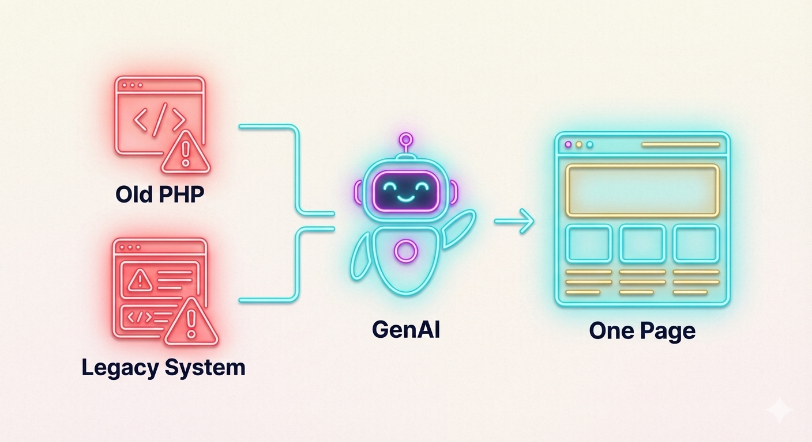

## はじめに：OS のサポート終了と同じことが、Web 環境でも起きている

Windows 10 のサポート終了が迫ると、多くの企業が Windows 11 への移行を余儀なくされている。新しい OS が不要だと思っていても、**サポート切れという現実の前には、選択肢の余地がない**。

実は、Web サイトの運営でも全く同じことが起きている。

私たちのホームページはかつて、Quick Homepage Maker（qhm）というシステムで運営されていた。2020 年時点では、それなりに機能的で、小規模な製造業には十分だった。ところが、**2025 年になって、突然その選択肢が失われた**。

きっかけは、レンタルサーバーの古い PHP バージョンのサポート終了という、一見すると「技術的な話」だった。ところが、その背後にあったのは、セキュリティリスク、システム老朽化、そして時代の変化という、もっと大きな流れだった。

この記事では、「環境のサポート切れに伴う選択肢」の一つとして、私たちが何をどう判断したのかを記録したい。同じ状況に直面している企業の経営層にとって、判断の軸になるはずだ。

---

## 第1章：qhm の限界 — 古い PHP バージョンのサポート終了による強制アップグレード

### 1-1. レンタルサーバーの「サポート終了通知」

2024 年の終盤、レンタルサーバーから一通の通知が届いた。

> 「今後、複数の古い PHP バージョンのサポートを段階的に終了予定です。最新の PHP バージョンへのアップグレードをお願いいたします。」

正直なところ、最初は「サポート終了？何それ」という感じだった。サイト運営の担当者として、技術的な詳細は理解していなかった。ただ、「何かの変更が必要」ということだけは伝わってきた。

ところが、詳しく調べるうちに、この「単なるサーバー設定の変更」では済まないことに気づいた。

### 1-2. Windows 10 → Windows 11 と同じ構図

古い PHP バージョンのサポート終了は、**Windows 10 のサポート終了と全く同じ構図**だ。

Windows 10 をまだ使っていたい企業も多いだろう。ただし、マイクロソフトのサポートが終われば、セキュリティ更新は提供されない。脆弱性が発見されても修正されない OS で業務を続けることは、経営判断としてあり得ない。

古い PHP バージョンも同じだった。サポート終了ということは、**脆弱性が発見されても修正されない言語で、Web サイトを運営する**ということを意味していた。

特に、Web サイトはインターネットに公開されている。攻撃のリスクは非常に高い。セキュリティサポートが終わった環境での運営は、企業としてのリスク管理に反する。

### 1-3. 外的圧力：セキュリティインシデントが示した現実

この時期、ニュースでも似たような事件を目にしていた。

2025 年の大手通販企業（アスクル等）での大規模なセキュリティインシデントは、古いシステムの脆弱性が原因だった。「自社は大丈夫だろう」と思っていた企業が、突然の攻撃で大きな被害を被る事例だ。

小規模な製造業だからといって、セキュリティの脅威から免れるわけではない。むしろ、セキュリティ対策の手薄な中小企業が標的になることも多いと聞く。

「古い PHP バージョンのサポート終了」は、単なる技術的な話ではなく、**経営上のリスク**だったのだ。

### 1-4. qhm との部分修正は通用しない

最初の選択肢として、「qhm だけアップグレードすれば大丈夫では？」と考えた。

ところが、qhm は古い PHP バージョン時代のシステムで、新しい PHP バージョンへの対応が不完全だった。特に、問い合わせフォーム機能が新しい PHP 環境で正しく動作しないのだ。

単にフォーム部分を修正すれば済む問題ではなかった。qhm 全体が、古い PHP バージョンを前提に設計されていたからだ。部分修正では対応できない構造的な問題だった。

**「サポート終了」は、部分修正の余地を与えてくれない。** 全面的な対応が必要だったのだ。

---

## 第2章：過去の検討と選択 — 2020 年の CMS 検討から、5 年の時間差

### 2-1. 2020 年：別の CMS システムの検討

今から 5 年前の 2020 年、実は同じような選択肢に直面していた。

その時も、qhm のシステム老朽化が課題だった。「新しい CMS に移行してはどうか」という提案があり、いくつかの選択肢を検討した。その中に、有名な CMS システムも含まれていた。

検討のプロセスは、次のようなものだった。

まず、新しい CMS システムをインストールすることは簡単だった。「セットアップウィザード」に従えば、数時間でシステムが立ち上がる。

ところが、その次が問題だった。自社の企業イメージに合わせて、デザインをカスタマイズしようとしたのだ。すると、膨大なマニュアルが必要になることに気づいた。

新しいシステムは、複雑な設定項目と多くのプラグイン、テーマのカスタマイズ方法がある。それを 1 から学ぶには、かなりの時間と専門知識が必要だった。

その時点での結論は、「外注に頼む必要があるな」というものだった。新しい CMS に移行するなら、ベンダーに依頼して設計・実装してもらう選択肢しかないと思っていた。

### 2-2. 2020 年時点での判断：「外注」という制約

その時の経営判断は、「外注に頼むなら、今の qhm でいいのではないか」というものだった。

既に qhm で運営しており、追加の投資や外注費をかけてまで、新しいシステムに移行する必然性がなかったのだ。

特に、小規模な製造業では、 Web サイトは「営業活動の補助」という位置付けだ。それに数百万円の投資をするのは、経営判断として慎重にならざるを得ない。

その結果、**「サポート終了まで、今の qhm で続ける」という判断に至った。** 当時は、それが最適な選択肢だと思っていた。

### 2-3. 2025 年：時代の変化

それから 5 年が経ち、2025 年になった。再び、同じ選択肢に直面した。

ところが、この 5 年の間に、**大きな変化が起きていた。**

それが、生成AI の登場だ。

---

## 第3章：時代の変化 — 生成AI が選択肢を変えた

### 3-1. 2020 年との決定的な違い：生成AI の存在

2025 年時点での最大の違いは、**自社で内製化することが現実的に可能になった**ということだ。

2020 年の検討では、新しい CMS システムに移行するには「外注が必須」だと思っていた。ベンダーに依頼して設計・実装してもらう以外に、道がないと考えていたのだ。

ところが、2025 年は違う。Claude などの生成AI を活用すれば、自分たちで学習しながらシステムを構築することが可能になっていた。

具体的には、このプロジェクト自体がその証だ。**技術ブログプロジェクトは、外注に頼らず、自分たちで企画・構築・運営している。** 生成AI との対話を通じて、技術的な課題を解決しながら、進めることができている。

2020 年には考えもしなかった選択肢が、5 年で現実になった。

### 3-2. 生成AI の活用による内製化

では、生成AI が何を変えたのか。

従来は、「新しい技術を学ぶ→マニュアルを読む→試行錯誤→（それでもダメなら）外注に頼む」というフローだった。学習コストが高く、途中で挫折することも多かった。

ところが、生成AI との対話では、「わからないことを聞く→すぐに答えが返ってくる→試してみる」というサイクルが高速になった。

マニュアルを 1 から読むのではなく、「自分の状況に合わせた説明」を AI に要求できる。「なぜこうなるのか」という原理原則も、簡潔に説明してくれる。

これは、**学習コストを大幅に削減する**。外注を頼まなくても、自社で技術的な課題を解決する道が開けたのだ。

### 3-3. 「内製化可能」が判断を変える

この変化は、経営判断を大きく変えた。

2020 年：「新しいシステムに移行 = 外注が必須 = 高額な投資」→ 判断：qhm でいい

2025 年：「新しいシステムに移行 = 自社で内製化可能 = 投資コスト削減」→ 判断：選択肢を再検討する価値がある

生成AI が選択肢の経営的な優位性を変えてしまった。

---

## 第4章：規模に応じた選択肢 — ワンページ vs 複数ページの判断

### 4-1. システム選定の軸：複数ページは本当に必要か？

新しいシステムを検討する際、まず検討したのは「複数ページのシステムが本当に必要か」という問い自体だった。

従来は、「Web サイト = 複数ページが基本」という思い込みがあった。会社紹介、製品紹介、お知らせ、問い合わせ……複数のページに分かれているのが当たり前だと思っていた。

ところが、最近のインターネット利用パターンを観察していて、気づくことがある。

### 4-2. ユーザー体験の変化：スクロール最適化の普及

最近、自分自身がインターネットでアクセスする際、気づいたことがある。やたらとスクロールするページが増えたということだ。

特にスマートフォンの普及に伴い、Web ページ自体が「スクロール最適化」された構造に変わってきた。

従来は「複数ページに分けて情報を整理する」というアプローチが主流だった。ところが、スマートフォンでの利用が当たり前になると、「ページの切り替え」よりも「スクロール」の方が自然になったのだ。

実例をあげれば：

- **ランディングページ（1 ページ）**：スクロールするだけで、企業情報、製品情報、事例、問い合わせまでが一貫している
- **複数ページサイト**：ページを切り替えるために、毎回ナビゲーションボタンをタップする必要がある

ユーザーにとって、どちらが効率的か。

スマートフォン時代では、スクロールで完結する方が、利用者体験としてシンプルになった。

### 4-3. ワンページ戦略の採用

こうした観察に基づいて、私たちは**ワンページ構成のシステム**を選定することにした。

複数ページを持つ複雑なシステムではなく、シンプルに「必要な情報を、スクロール一本で閲覧できる」という設計に変更した。

この判断は、単なる「技術的な理由」ではない。**ユーザー体験の変化に基づいた選択**だ。

ユーザーの使い方が変われば、サイト設計も変わる。それが、2025 年の判断だった。

---

## 第5章：意思決定フレーム — 何を基準に選ぶのか

### 5-1. 環境サポート切れから選択肢が生まれる

ここまでの話をまとめると、判断の軸は以下の通りだ。

**外的要因（コントロール不可）：**
- 古い PHP バージョンのサポート終了という現実
- セキュリティリスクへの責任

**内的要因（自社判断）：**
- qhm での部分修正は不可能という技術的制約
- 生成AI による内製化が可能になったという環境変化
- ユーザー体験の変化に対応する必要性

これらが重なったとき、初めて「新しいシステムへの移行」という判断が、経営上の意味を持つようになった。

### 5-2. コスト vs 効果の再評価

2020 年の判断では、「新しいシステムに移行 = 高額な外注費」と考えていた。

2025 年の判断では、「新しいシステムに移行 = 生成AI を活用した内製化」と考えた。

この変化が、**経営的な優位性を逆転させた。**

単に「新しいシステムを導入する」のではなく、「生成AI とのコラボレーションで、自社の技術力を高めながら構築する」という判断に変わったのだ。

これは、技術ブログプロジェクトとして、外部に発信できる知見にもなる。移行過程で学んだことを、記事として公開することで、他の企業にも価値を提供できる。

### 5-3. 判断のポイント：制約から選択肢を見つける

環境のサポート切れに直面したとき、焦らずに問うべき質問は以下の通りだ。

- **技術的な制約は何か？** → 古い PHP バージョンのサポート終了、qhm の新バージョン PHP への非対応
- **外注に頼らない選択肢はあるか？** → 生成AI による内製化
- **ユーザーのニーズは本当に変わったか？** → スクロール最適化の観察
- **投資の効果は期待できるか？** → 技術知見の蓄積と外部発信

これらの問いに対して「制約を受け入れながらも、前向きな判断」をできるかどうかが、経営判断の質を決める。

---

## おわりに：「今」選択する理由

環境のサポート切れというのは、一見すると「不幸なタイミング」に見える。

ところが、実際には、**「今だからこそ選択できる」という好機**でもある。

2020 年なら、選択肢は「qhm を続ける」か「高額な外注に頼む」かのいずれかだった。

2025 年は、それに加えて「生成AI を活用した自社構築」という第三の道が開けた。

制約を受け入れながらも、その中で最適な選択肢を見つける。セキュリティリスクに対応しながらも、ユーザー体験を向上させる。技術ブログで知見を発信しながらも、自社の技術力を高める。

こうした「複数の価値を同時に実現する判断」が、経営層に求められていると思う。

環境のサポート切れに直面している企業の担当者へ：焦らず、制約の中で、あなたの現状に合わせた選択肢を探してほしい。技術的な話に聞こえるかもしれないが、実は、**判断のフレームは経営判断そのもの**だからだ。
