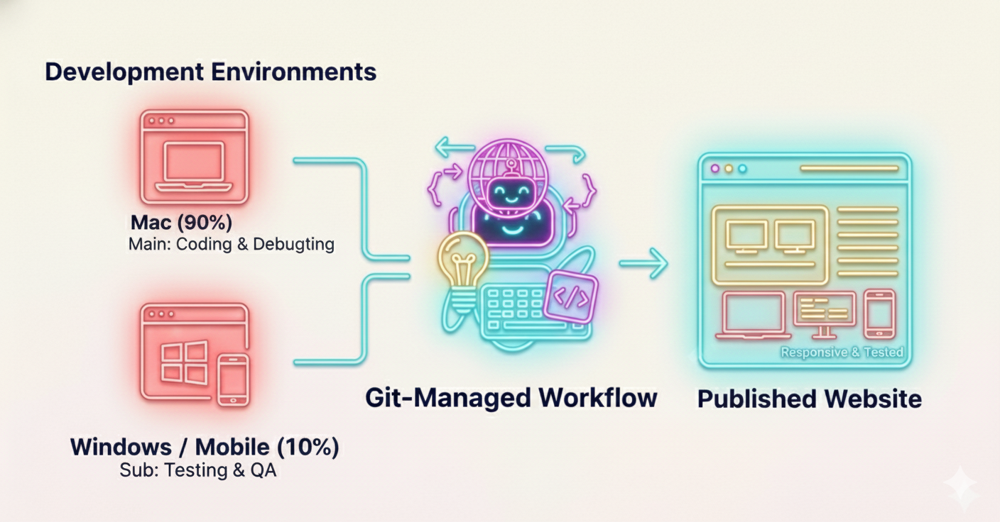

## はじめに：複数拠点での開発管理の課題

前編では、HP リニューアルプロジェクトで Git とコミットメッセージの重要性を学びました。

ところが、実装が進むにつれて、新しい課題が浮上してきました。それが **複数環境での並行開発** という現実です。

自社の開発環境は、自宅の Mac mini M1 と、オフィスの Windows 11 Pro という、異なるシステムを使用しています。どちらでも開発作業を続ける必要がありました。

その中で、以下の問題に直面しました：

- ファイルを 2 つの環境で同期させるには？
- どちらの環境を「メイン」にするべきか？
- スマートフォンやタブレットでの確認も必要だが、どう管理するか？

この記事では、複数環境での開発をどう現実的に運用したのか、その経験を記録します。

---

## 第1章：なぜ Dropbox ではなく Git を選んだのか

### 1-1. Dropbox でも同期環境は作れたはず

実は、複数環境でのファイル同期なら、Dropbox や Google Drive でも可能です。

自宅の Mac でファイルを編集すれば、Dropbox が自動で同期して、オフィスの Windows から最新版が見られる。ローカルネットワークではなく、クラウドを経由すれば、拠点間での同期は実現できます。

ファイルの管理という観点だけなら、クラウドストレージで十分でした。

### 1-2. では、なぜ Git を選んだのか

正直に言えば、**特別な理由があったわけではありません**。

ただ、いくつかの要因が重なっていました。

**理由① メーリングリストや技術ニュースの蓄積**

前編でも触れましたが、このプロジェクト以前から、開発関連のメーリングリストを購読していました。定期的に「バージョン管理の重要性」という話題が流れてきていたのです。

技術的な詳細は理解していなくても、「バージョン管理は大事」という認識は、無意識のうちに形成されていました。

**理由② FFFTP の公式サイトが GitHub にあった**

HP リニューアルでは、サーバーへのファイルアップロードに FFFTP というツールを使用していました。

ある時、このツールのバグが見つかり、最新版を探しました。その時に目にしたのが **FFFTP の公式リポジトリが GitHub で公開されていた** ということです。

まだ具体的に Git を理解していなかったとしても、「Git」「GitHub」というキーワードは既に目に入っていました。

**理由③ 「なんとなく正しい選択」という感覚**

結果的には、これが最も重要だったかもしれません。

「バージョン管理が大事」という知識と「GitHub という存在」が既に頭の中にあり、ファイル管理の課題に直面した時に「試してみるか」となったのです。

つまり、**必要に迫られたというより、なんとなく正しい選択をしていた**という状態でした。

---

## 第2章：Git による複数環境での運用

### 2-1. クラウドストレージとの決定的な違い

Dropbox でも Git でもファイルは同期されます。では何が違うのか。

それは、**変更の意図と履歴の記録方式** です。

**Dropbox の場合**
```
ファイル同期：自動で最新版を反映
変更の記録：タイムスタンプと版数のみ
「誰が何を変えた」：メモが必要
ロールバック：「この日時に戻す」は可能だが、
　　　　　　　なぜ戻すのかの判断が難しい
```

**Git の場合**
```
ファイル同期：コミットで明示的に記録
変更の記録：コミットメッセージで意図を記載
「誰が何を変えた」：メッセージで明確
ロールバック：「なぜこの変更を戻すのか」が
　　　　　　　履歴から判断できる
```

### 2-2. 複数環境での Git 運用フロー

自宅（Mac）でコードを編集 → コミット → プッシュ

オフィス（Windows）で最新版をプル → 動作確認 → 必要に応じて修正 → コミット → プッシュ

このように、環境を切り替えながら開発を進める場合、Git のコミットメッセージが非常に有用です。

例えば：
```
feat: モバイルレイアウト対応 - iPhone SE での表示確認済み

- ビューポート設定を調整
- タッチイベント対応
- Windows 11 環境で検証中
```

このコミットメッセージを見れば、「Mac で作成した機能」が「Windows で検証中」という状態が、コードを見なくても理解できます。

### 2-3. マージと複数環境での統合

複数環境での開発が進むと、時には「自宅での変更」と「オフィスでの変更」が同じファイルに入ることがあります。

**クラウドストレージの場合**
```
ファイル A（Mac で編集）
↓自動同期
ファイル A（Windows で上書き）
→ 一方の変更が失われる
→ 結果：「ファイル A（競合コピー）」という別ファイルが生成される
→ どちらが正しいのか、手動で判断する必要がある
```

**Git の場合**
```
commit A（Mac：スクロール機能を修正）
commit B（Windows：フォーム検証を修正）
↓
git merge
→ 両方の変更を認識
→ コードの衝突箇所を 1 行単位で解消
→ 両方の修正を統合できる
```

Git では、このように複数の変更を「安全に統合」できるのです。

実際の例：

```markdown
## Mac での修正（スクロール機能）
+ function smoothScroll() {
+   window.scrollTo({behavior: 'smooth'});
+ }

## Windows での修正（フォーム検証）
+ function validateForm() {
+   if (name === '') return false;
+ }

## マージ後（両方の修正が統合）
+ function smoothScroll() {
+   window.scrollTo({behavior: 'smooth'});
+ }
+ function validateForm() {
+   if (name === '') return false;
+ }
```

このように、同じファイルでの異なる変更が、競合ファイルを生成することなく、統合できるのです。

---

## 第3章：複数環境での現実的な課題

### 3-1. 環境設定の整備コスト

複数環境で開発する場合、それぞれの環境を「開発環境として整える」必要があります。

- Node.js のバージョン
- PHP のバージョン
- データベース設定
- ローカルサーバーの設定

これらを 2 つの環境で完璧に整える、というのはかなりの手間です。

特に、自宅と会社という物理的に異なる拠点では、環境設定のトラブルが起きた時に、その場で対応しづらいという課題があります。

### 3-2. シンプルさの追求

当初は「Windows でも Mac でも、同じ開発環境を作ろう」と考えていました。

ところが、時間が経つにつれて気づいたことがあります：

**複数環境での開発を完璧に同期させるのは、個人では持続不可能** ということです。

設定の違いからくるトラブル、バージョン差による動作不具合、そうしたことに対応しているうちに、実装時間が削られてしまいます。

そこで判断を変えました。環境設定を完璧に同期させるのではなく、「シンプルに使える最小限の環境」に絞るという判断です。

メイン環境（Mac）では開発に必要な全ての設定を行い、サブ環境（Windows）では「確認に必要な最小限」だけを整える、という選択をしました。

---

## 第4章：複数環境での確認の必要性

### 4-1. スマートフォン・タブレット確認は必須

HP リニューアルの主要テーマの一つが「モバイル対応」でした。

Mac のブラウザで「レスポンシブデザインで確認」することはできます。

ところが、実際のスマートフォンやタブレットで表示してみると、想定と異なることがあります。

- タッチ操作の反応
- スクロールの滑らかさ
- 画面サイズごとの微調整

こうしたことを確認するには、実際のデバイスでの検証が欠かせません。

### 4-2. Windows での確認も必要

同様に、ブラウザのシェアを考えると、Windows ユーザーでの確認も重要です。

Mac の Safari で完璧でも、Windows の Chrome では表示がずれていることもあります。

つまり、**複数環境（複数デバイス、複数 OS）での確認は、どうしても必要** なのです。

---

## 第5章：メイン9:サブ1の役割分けで持続可能な開発へ

### 5-1. 複数環境での開発は楽ではない

これまで述べてきた通り、複数環境での開発には以下の課題があります：

- 環境設定の整備コスト
- 拠点間での「開発のつながり」が切れやすい
- トラブルシューティングの手間が増える

完璧に両立させようとすれば、それなりのコストがかかります。

### 5-2. しかし、確認は必須

一方で、スマートフォン、タブレット、Windows での確認を避けることはできません。

実際のユーザー体験は、自分が開発している環境だけでは判断できないのです。

### 5-3. メイン環境での開発に集約する

そこで決めた運用パターンが、**メイン環境（Mac）での開発に集約し、サブ環境（Windows）では確認に徹する** というアプローチです。

具体的には：

**Mac（メイン環境）での作業：90%**
- コード実装
- デバッグ
- 新機能の開発
- Git リポジトリの管理

**Windows（サブ環境）での作業：10%**
- 実装した機能の確認
- Windows/Chrome での表示確認
- 修正が必要な場合のバグ報告
- 簡単な修正は Mac に戻してから実施

### 5-4. 役割分けの利点

このパターンに落ち着いたことで、以下のことが実現できました：

- **環境設定の複雑さが軽減**：Mac だけを整備すればよい
- **開発のつながりが保たれる**：主な開発は Mac で完結するので、思考が断続しない
- **複数環境での確認は実現**：Windows でも確認できるので、ユーザー体験を把握できる
- **本業との両立が可能**：個人で本業の合間に開発を続けるにはちょうどいい配分

---

## おわりに：個人で本業の合間での開発を持続させるために

複数環境での開発は、確かに楽ではありません。

でも、現代の Web 開発では、複数のデバイス・OS での確認は避けられません。

だからといって、「メイン環境とサブ環境で完璧に同じ状態を保つ」という完璧性を求めると、設定やトラブルシューティングに時間を取られ、肝心の実装が進みません。

小規模な企業、あるいは個人で開発を続ける場合、現実的な妥協点を見つけることが重要です。

> **メイン 9：サブ 1** という役割分けは、その妥協点の一つです。
>
> - 開発効率は落とさない（メイン環境で集約）
> - ユーザー体験は確認できる（サブ環境で検証）
> - 本業の合間で持続できる（設定コストを最小化）

前編で Git とコミットメッセージの重要性を学びました。

後編では、その Git をどのように現実の開発環境に組み込むのか、という実務的な話でした。

複数環境での開発に直面している小規模企業やフリーランスの開発者にとって、この試行錯誤の記録が参考になれば幸いです。
